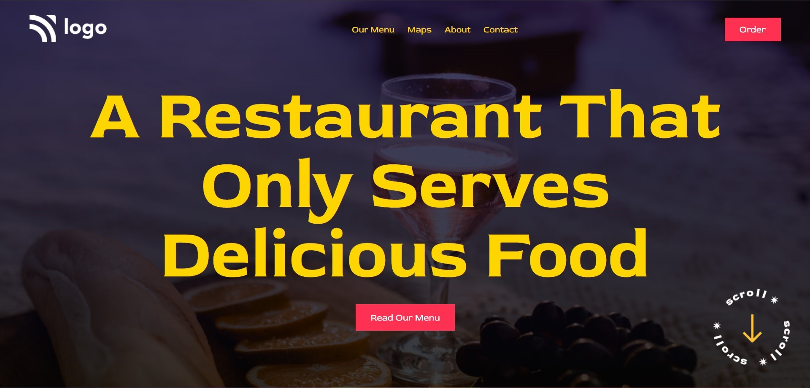

# Project 2 - HTML  and CSS 

By Shubham

Here's the Live Deployed Website 

[Link to the Project 1]("https://iNeuronEats.netlify.app/")
https://iNeuronEats.netlify.app/

## What I learned from this Project?

- I learned about positioning around the webpage.
- I also learned about the ways of tackling background in the HTML and CSS.
- I also learned how to add gradient for the background and Blend Mode.
- I also learned how to add diffrent fonts from the Google Fonts
- I also learned how to design Buttons and Navbar.

## This project took around 2 hours to complete.
